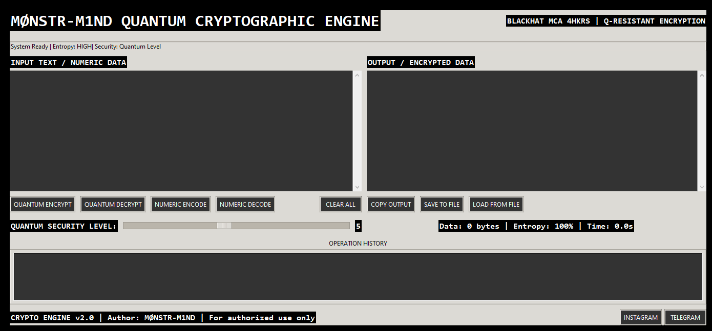

# MØNSTR-M1ND CRYPTOGRAPHIC ENGINE
[](http://t.me/monstr_m1nd)
[](https://www.instagram.com/httpx.mrmonsif/)

**Quantum-Resistant Encryption System**
Professional-grade cryptographic engine with quantum-resistant encryption and numeric encoding. Built for secure communications.
## Features
Quantum-resistant multi-layer encryption
Dynamic key generation with entropy injection
Numeric encoding for high-security applications
Professional black/white GUI interface
Background entropy collection
Military grade security levels (1-10)

## Technical Specifications
**Algorithm**: Chaotic quantum-resistant encryption
**Key Space**: 2^256 minimum
**Entropy Sources**: 5+ independent sources
**Security Levels**: Configurable from 1-10
**Output**: JSON-encoded encrypted packages

## Installation

### Option 1: Use Executable (Recommended)
1 Download `MonstrCrypt.exe`
2 Run the executable directly
3 No installation required

### Option 2: Run from Source Code
If you want to run from Python source:

1 Install Python 3.8 or higher
2 Install required libraries:
```bash
pip install pycryptodome
pip install tkinter
```

3 Run the script:
```bash
python monstr_crypto.py
```
## Usage
1 Launch MonstrCrypt.exe (or run the Python script)
2 Enter text in input field
3 Select security level (1-10)
4 Click:
   **QUANTUM ENCRYPT** for encryption
   **NUMERIC ENCODE** for numeric conversion
   Corresponding decrypt/decode buttons for reversal
## Requirements
- Windows 10/11 (64-bit)
- 4GB RAM minimum
- .NET Framework 4.8 (for executable)
- Python 3.8+ (for source code)
## Author
**MØNSTR-M1ND**  
Blackhat MCA 4HKRS
## Contact
[](http://t.me/monstr_m1nd)
[](https://www.instagram.com/httpx.mrmonsif/)
## Version
2.0 (Stable Release)
## Notes
System includes built-in entropy monitoring
All operations logged in history panel
Output can be saved to file or copied to clipboard
The executable `MonstrCrypt.exe` includes all dependencies - no additional installations needed
